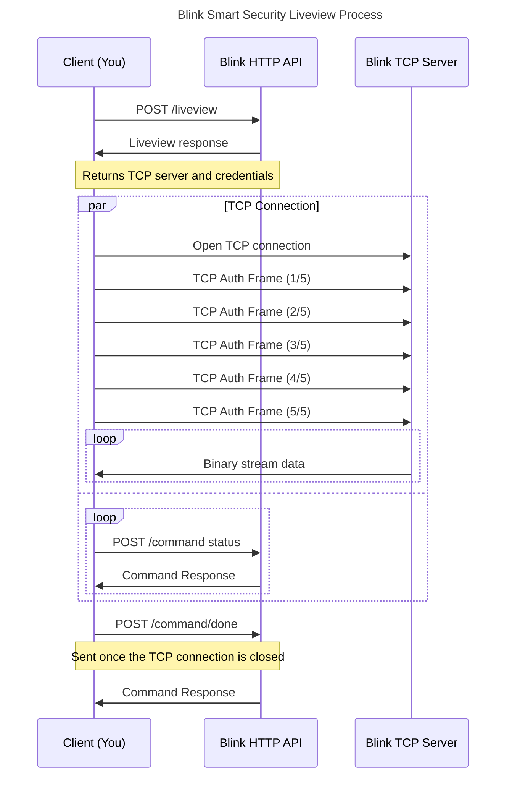

# Introduction

This project offers access into the liveview functionality of the Blink Smart
Security cameras. It has three entrypoints:

- A WebSocket service that can act as middleware between a web application and
the Blink Smart Security Camera
- A command to login to a Blink account and list the cameras available for liveview
- A command to watch the liveview stream from the command line (ffmpeg)

[](https://goreportcard.com/report/github.com/amattu2/blink-liveview-middleware)
[](https://github.com/amattu2/blink-liveview-middleware/actions/workflows/test.yml)
[](https://github.com/amattu2/blink-liveview-middleware/actions/workflows/codeql.yml)

# Usage

See the following sections for more information on how to use each entry point.
These sections provide instructions on usage without compiling the code yourself.
If you would like to compile the code yourself, see the
Building From Source section below.

```bash
go run main.go <command> [flags]
```

> [!WARNING]
> Prior to running any of the commands, ensure that you have ffmpeg installed
> on your system, and configured in your PATH (if applicable).

## Account Command

The account command is a simple interface for interacting with the Blink Liveview
APIs without retrieving technical connection details on your own. Provide the email
address and password for the Blink account you wish to use, and the command will
perform the necessary steps to obtain the API token and account information.

Once retrieved, it will prompt you to select a camera to watch the liveview stream
from, and then open the liveview stream in a new window using ffplay.

Additionally, the command will output the API Token, Account ID, and Region, which
can be used to shortcut the process in the future.

```bash
go run main.go account \
    [--email=<email>] \
    [--token=<api token> --account-id=<account id> --region=<region>] \
    [--print-exports]
```

An explanation of the command line flags is provided below:

Option 1: Email & Password

- `-e`, `--email`: The email address of the Blink account to use

> [!NOTE]
> The password is not provided as a command line flag for security reasons.
> You will be prompted to enter the password after running the command.

Option 2: API Token, Account ID, & Region

- `-t`, `--token`: The API token for the current session. This is returned via
the Blink login flow (or use `BLINK_TOKEN` environment variable)
- `-a`, `--account-id`: The account ID of the Blink account (or use `BLINK_ACCOUNT_ID` environment variable)
- `-r`, `--region`: The region of the Blink account (e.g. `u014`, `u011`, etc.) (or use `BLINK_REGION` environment variable)

Additional Options:

- `--print-exports`: Print shell export statements for credentials instead of starting liveview.
This is useful for setting up environment variables for later use.

Example with print-exports:

```bash
# Login and print exports
eval $(go run main.go account --email=user@example.com --print-exports)

# Now you can use the liveview command without providing credentials
go run main.go liveview
```

## Liveview Command

The liveview command is a direct way to watch the liveview stream from a Blink
Smart Security Camera. It can be used in place of the above "account command"
if you already have all of the necessary information to connect to the Blink API.

This is made available primarily used for testing, but can be used as
a standalone tool if desired.

Upon running the command, you should see a new ffplay window open with the
liveview stream (default behavior). Alternatively, you can publish the stream
to an RTSP server using the `--output rtsp` flag.

```bash
go run main.go liveview \
  --region=<region> \
  --token=<api token> \
  --device-type=<device type> \
  --account-id=<account id> \
  --network-id=<network id> \
  --camera-id=<camera id> \
  [--output=<ffplay|rtsp>]
```

An explanation of the command line flags is provided below:

- `-r`, `--region`: The region of the Blink account (e.g. `u014`, `u011`, etc.).
This is returned via the Blink login flow (or use `BLINK_REGION` environment variable)
- `-t`, `--token`: The API token for the current session. This is also returned via
the Blink login flow (or use `BLINK_TOKEN` environment variable)
- `-d`, `--device-type`: The type of (camera) device to connect to (e.g. `owl`, `doorbell`).
(or use `BLINK_DEVICE_TYPE` environment variable)
- `-a`, `--account-id`: The account ID of the Blink account (or use `BLINK_ACCOUNT_ID` environment variable)
- `-n`, `--network-id`: The ID of the network that the camera is on (or use `BLINK_NETWORK_ID` environment variable)
- `-c`, `--camera-id`: The ID of the camera to watch (or use `BLINK_CAMERA_ID` environment variable)
- `-o`, `--output`: Output mode - `ffplay` (default, opens a video player) or `rtsp` (publishes to RTSP server).
(or use `LIVEVIEW_OUTPUT` environment variable)

### RTSP Publishing

When using `--output rtsp`, the stream will be published to an RTSP server instead of
opening ffplay. This requires:

1. An RTSP server (e.g., MediaMTX) running and accessible
2. The `RTSP_BASE_URL` environment variable set to the RTSP server base URL

The stream will be published to `{RTSP_BASE_URL}/blink-{camera-id}`.

Example:

```bash
# Set the RTSP server URL
export RTSP_BASE_URL=rtsp://localhost:8554

# Publish to RTSP
go run main.go liveview \
  --region=u011 \
  --token=abc123 \
  --device-type=owl \
  --account-id=12345 \
  --network-id=67890 \
  --camera-id=11111 \
  --output=rtsp
```

### Using Environment Variables

All credentials and configuration can be provided via environment variables,
making it easier to use in containerized environments:

```bash
export BLINK_REGION=u011
export BLINK_TOKEN=abc123
export BLINK_DEVICE_TYPE=owl
export BLINK_ACCOUNT_ID=12345
export BLINK_NETWORK_ID=67890
export BLINK_CAMERA_ID=11111
export LIVEVIEW_OUTPUT=rtsp
export RTSP_BASE_URL=rtsp://localhost:8554

# Now you can run without any flags
go run main.go liveview
```

## WebSocket Middleware

This section is broken down into two parts: the server and the client. The server
is a WebSocket service that acts as middleware between a web application and the
Blink Smart Security Camera. The client section provides an example of how to
interface with the WebSocket server using JavaScript.

Out of the box, the server provides a demo UI that can be used to test the liveview
stream via a web browser.

### Server Usage

The server is a basic Go HTTP server that utilizes the Gorilla WebSocket library.
It has no built-in authentication or knowledge of the Blink API (beyond liveview),
so it is entirely up to your implementing application to provide the necessary
information to the server.

Each client that connects to the WebSocket is independent
of the others, so you can have multiple streams running at the same time
without overlapping.

Start the server with the following command:

```bash
go run main.go server [--address=<addr>] [--env=<env>] [--origins=<origins>]
```

An explanation of the command line flags is provided below:

- `-a`, `--address`: The address to bind the server to (e.g. `:8080`)
- `-e`, `--env`: The environment to run the server in (`development`, `production`).
If `production` is specified, the demo UI will be disabled.
- `-o`, `--origins`: A comma-separated list of allowed WebSocket client origins.
By default, the current origin is allowed. Use `*` to allow all origins.

Then open the sample web application in your browser. Provide the necessary
authentication information on the demo UI and click the "Start Liveview" button:

<http://localhost:8080/index.html>

> [!NOTE]
> The server does not currently limit the maximum number of clients that can
> connect OR liveview at the same time. This may cause performance issues.

### Client Usage

Each client that connects to the WebSocket server is independent of the others,
which means that each client must forward the Blink authentication information
to the server once connected.

By default, the server will close the connection if the client does not start
liveview or send some sort of command within `8 seconds` of connecting.

The following is an example of how to connect to the WebSocket server using
JavaScript:

```javascript
// Open a WebSocket connection to the server
const ws = new WebSocket('ws://localhost:8080/liveview');
ws.binaryType = "arraybuffer";

ws.onopen = () => {
    // Send the authentication information to the server
    // NOTE: This should be done within 8 seconds of connecting,
    // or the server will close the connection
    const data = JSON.stringify({
        command: "liveview:start",
        data: {
            // Refer to the liveview CLI arguments for details on these fields
            account_region: "",
            api_token: "",
            account_id: "",
            network_id: "",
            camera_id: "",
            camera_type: "",
        },
    });

    ws.send(data);
};

// Handle incoming messages from the server
ws.onmessage = (evt) => {
    if (evt.data instanceof ArrayBuffer) {
        // Handle incoming video packets
        return;
    }

    const data = JSON.parse(evt.data);
    if (data?.command === "liveview:stop") {
        // The server stopped the liveview
        // Handle receipt of the stop command (e.g. stop the video player)
    } else if (data?.command === "liveview:start") {
        // The server opened the liveview
        // binary data will begin shortly (delay of about 5 seconds)
    }
};
```

Refer to the demo UI [source code](static/index.html) for a more detailed example
of how to connect and integrate the liveview stream into your web application.

## Building From Source

Using make, you can build the project for your platform. The Makefile
provides a simple interface for building the project, but you can also
build it manually using the `go build` command.

To build the project using make for all platforms, run the following command:

```bash
make build
```

To build a specific platform, use the `build_[platform]` target.

```bash
make build_[platform]
```

Platforms: `linux`, `mac`, `freebsd`, `windows`

To build the project manually, you can use the `go build` command. The

```bash
go build -a -o bin/file_name_here main.go
```

To clean the workspace and remove any generated files, run:

```bash
make clean
```

## Docker Usage

This project includes a Dockerfile and docker-compose.yml for easy deployment
in containerized environments.

### Building the Docker Image

To build the Docker image:

```bash
docker build -t blink-liveview-middleware .
```

The Dockerfile uses a multi-stage build:
1. Build stage: Uses `golang:alpine` to compile the application
2. Runtime stage: Uses `alpine` with ffmpeg installed for a minimal image

### Using Docker Compose

The included `docker-compose.yml` file sets up both the Blink liveview middleware
and a MediaMTX RTSP server for easy RTSP streaming.

1. Create a `.env` file with your Blink credentials:

```bash
BLINK_REGION=u011
BLINK_TOKEN=your_token_here
BLINK_DEVICE_TYPE=owl
BLINK_ACCOUNT_ID=12345
BLINK_NETWORK_ID=67890
BLINK_CAMERA_ID=11111
LIVEVIEW_OUTPUT=rtsp
RTSP_BASE_URL=rtsp://mediamtx:8554
```

2. Start the services:

```bash
docker-compose up
```

This will:
- Start a MediaMTX RTSP server on port 8554
- Start the Blink liveview middleware, publishing the stream to MediaMTX
- The stream will be available at `rtsp://localhost:8554/blink-{camera-id}`

3. View the stream with any RTSP client:

```bash
ffplay rtsp://localhost:8554/blink-11111
```

Or use VLC, OBS, or any other RTSP-compatible player.

### Running the Container Manually

You can also run the container manually:

```bash
docker run \
  -e BLINK_REGION=u011 \
  -e BLINK_TOKEN=your_token \
  -e BLINK_DEVICE_TYPE=owl \
  -e BLINK_ACCOUNT_ID=12345 \
  -e BLINK_NETWORK_ID=67890 \
  -e BLINK_CAMERA_ID=11111 \
  -e LIVEVIEW_OUTPUT=rtsp \
  -e RTSP_BASE_URL=rtsp://your-rtsp-server:8554 \
  blink-liveview-middleware
```

To use ffplay mode instead (note: requires X11 forwarding or similar for display):

```bash
docker run \
  -e BLINK_REGION=u011 \
  -e BLINK_TOKEN=your_token \
  -e BLINK_DEVICE_TYPE=owl \
  -e BLINK_ACCOUNT_ID=12345 \
  -e BLINK_NETWORK_ID=67890 \
  -e BLINK_CAMERA_ID=11111 \
  blink-liveview-middleware
```

# Blink Liveview Process

The general process behind obtaining a liveview stream from a Blink camera is
outlined below, ignoring the specifics of the Blink API and any potential error states.



# Dependencies

- Go 1.23+
- Gorilla WebSocket
- ffmpeg / ffplay
